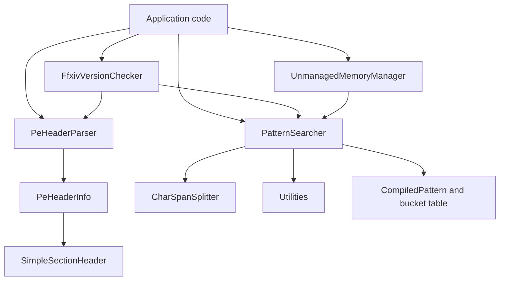
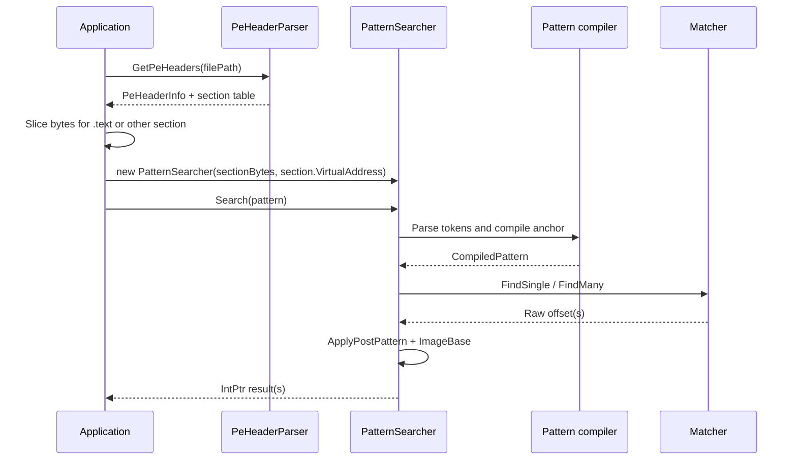

`Llama.Memory` is a single .NET assembly with one namespace, `Llama.Memory`, and a deliberately small public surface. The assembly exposes a scanner (`PatternSearcher`), a scanner contract (`ISearcher`), PE metadata records plus parser (`PeHeaderInfo`, `SimpleSectionHeader`, `PeHeaderParser`), an application-specific helper (`FfxivVersionChecker`), and two low-level helper modules (`UnmanagedMemoryManager<T>`, `CharSpanSplitter`, and `Utilities`).

## Module Relationships

The scanner is the center of the library. `PatternSearcher` in `Llama.Memory/PatternSearcher.cs` accepts a contiguous byte region and exposes the search operations defined by `ISearcher` in `Llama.Memory/ISearcher.cs`. All public search entry points delegate into a shared compilation and matching pipeline:

1. Parse the pattern string into bytes, wildcard masks, and optional post-match commands.
2. Build or reuse frequency tables for the underlying buffer.
3. Compile each pattern into an internal structure with the best anchor pair or single-byte anchor.
4. Scan the buffer using prefix rejection and full masked comparison.
5. Apply post-match commands and then add `ImageBase` to produce the final `IntPtr`.

The PE path is separate but complementary. `PeHeaderParser.GetPeHeaders` in `Llama.Memory/PeHeaderParser.cs` reads only enough header data to recover the image base and section table. Callers usually pair that result with `PatternSearcher` by slicing a PE section out of a file buffer and supplying the section `VirtualAddress` as `imageBase`.

`FfxivVersionChecker` shows the intended composition pattern. In `Llama.Memory/FfxivVersionChecker.cs`, `GetVersion` reads directly from the `.data` section using `RandomAccess.Read`, while `GetVersionPattern` parses PE metadata, scans the `.text` section for a version pointer, converts the resolved RVA-like result back to a file offset, and then parses the version string. That file is valuable because it demonstrates how the author expects the parser and scanner to be used together in real tooling.

## Key Design Decisions

### 1. The scanner owns bytes as `Memory<byte>`

`PatternSearcher` stores its input as `public readonly Memory<byte> Data` and offers constructors for `byte[]`, `Span<byte>`, `ReadOnlySpan<byte>`, and `Memory<byte>` (`PatternSearcher.cs`, lines 9 and 24-52). The important trade-off is that span-based constructors copy into a managed array via `ToArray()`, while the `Memory<byte>` constructor preserves the caller-owned memory without copying. This makes the API easy to call from both high-level and low-level code while still centering the implementation around a stable, sliceable backing store.

### 2. Pattern compilation is data-aware

The scanner does not anchor on the first concrete byte by default. `GetFrequencyTables` computes byte and pair frequencies from the actual buffer (`PatternSearcher.cs`, lines 127-157), and `BuildCompiled` chooses the least frequent fully specified adjacent pair when possible, falling back to the least frequent fully specified single byte (`PatternSearcher.cs`, lines 381-472). That choice reduces the number of expensive full-pattern comparisons in realistic binaries where common opcodes would otherwise produce many false positives.

### 3. Multi-pattern search uses buckets and optional parallelism

For array-based searches, the library compiles each pattern once, groups patterns by anchor into a `PatternBucketTable`, and scans the data once per chunk (`PatternSearcher.cs`, lines 513-652 and 654-1289). Once the input exceeds `256 * 1024` bytes and the process has more than one CPU, the scanner splits the work into overlapping chunks (`PatternSearcher.cs`, lines 11-12, 679-718, and 995-1034). The overlap is the maximum pattern length, which protects matches that straddle a chunk boundary.

### 4. Address transformation is embedded in the pattern syntax

Instead of returning only the raw match offset, the scanner lets the pattern describe how to walk from the match to the final result. `ApplyPostPattern` in `PatternSearcher.cs` interprets commands such as `Add`, `Sub`, `Read32`, `TraceRelative`, and `TraceCall` (`PatternSearcher.cs`, lines 1562-1661). This is why the library works well for reverse-engineering signatures where the developer usually wants the target of an instruction, not the instruction address itself.

### 5. The PE parser intentionally stops early

`PeHeaderParser` reads a header-sized buffer, validates the DOS and PE signatures, parses the optional header enough to determine the image base, and then decodes only the section table (`PeHeaderParser.cs`, lines 174-257). It does not model the whole PE format. That is a conscious scope decision: the parser exists to support scanning workflows, not to replace a full executable analysis library.

## Data Lifecycle

For file-backed analysis, `ImageBase` is usually the section `VirtualAddress`, not the executable's preferred image base. That detail is easy to miss, but it is consistent with the README example and with `FfxivVersionChecker.GetVersionPattern`. The library treats `ImageBase` as "the origin to add back onto raw buffer offsets," not as a PE-only semantic.

## How the Pieces Fit Together

`CharSpanSplitter` and `Utilities` are not merely incidental helpers. `GetPatternBytes` in `PatternSearcher.cs` relies on `Split()` from `CharSpanExtensions` to tokenize the pattern without allocating substrings during parsing, and then uses `Utilities.GetByte`, `Utilities.GetMask`, and `Utilities.IsValidHex` to turn each token into search bytes plus wildcard masks. Those helpers are why the scanner can accept half-wildcards like `4?` and `?F` while still compiling the pattern into simple byte arrays.

`UnmanagedMemoryManager<T>` exists for callers who already have native memory. The class wraps a raw pointer in a `Memory<T>` abstraction so the rest of the library can remain span- and memory-based. That keeps the unsafe boundary narrow: native memory handling lives in one type, while the scanner itself stays mostly focused on `ReadOnlySpan<byte>` operations.

The result is a small but coherent system. The parser establishes boundaries, the scanner resolves signatures, the helpers keep parsing and buffer access efficient, and the application-specific helper demonstrates an end-to-end workflow using the same building blocks you would use in your own tooling.
