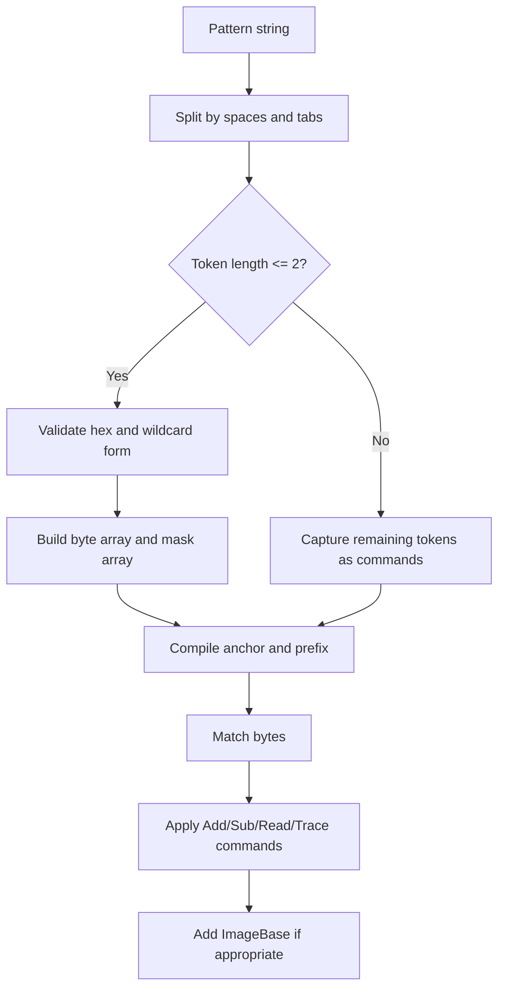

Pattern syntax is the main abstraction in `Llama.Memory`. A pattern string tells `PatternSearcher` two things at once: how to find a byte sequence and how to transform the raw match into the address you actually want.

## What It Is

A pattern is a space-separated string with two phases:

1. Hex-like tokens that describe the bytes to match.
2. Optional command tokens that run after the match is found.

Examples:

```text
48 8B ?? ?? 89
48 8D 0D ? ? ? ? Add 3 TraceRelative
E8 ? ? ? ? TraceCall
```

The first phase is compiled into byte and mask arrays. The second phase becomes a post-match command list consumed by `ApplyPostPattern` in `Llama.Memory/PatternSearcher.cs`.

## Why It Exists

Reverse-engineering signatures usually need more than a plain offset. You often find an instruction like `lea rcx, [rip+rel32]` or `call rel32`, then want the resolved target address. If the library only returned the instruction start, every caller would need to duplicate pointer arithmetic and endian reads. By making those transforms part of the pattern language, `Llama.Memory` keeps the calling code short and consistent.

## How It Relates to Other Concepts

- `PatternSearcher` executes the syntax.
- `Utilities` converts individual tokens into bytes and wildcard masks.
- `CharSpanSplitter` tokenizes the string with minimal overhead.
- `ImageBase` changes how final results are interpreted after command execution.

The syntax is therefore not just input validation. It drives the entire scanner pipeline.

## How It Works Internally

`GetPatternBytes` in `Llama.Memory/PatternSearcher.cs` walks the pattern token by token (`PatternSearcher.cs`, lines 206-305). It uses `Split()` from `Llama.Memory/CharSpanSplitter.cs` to iterate over whitespace-delimited tokens without allocating intermediate strings for the hex phase. Each token is then validated with `Utilities.IsValidHex` and converted using `Utilities.GetByte` and `Utilities.GetMask` (`Utilities.cs`, lines 16-82).

The mask logic is what enables wildcards:

- `??` or `?` yields mask `0x00`, which means "ignore both nibbles."
- `4?` yields mask `0xF0`, which means "only the high nibble must match."
- `?F` yields mask `0x0F`, which means "only the low nibble must match."
- `48` yields mask `0xFF`, which means "both nibbles must match exactly."

Once the parser hits a token longer than two characters, it switches to post-pattern mode and stores the remaining tokens as strings. Later, `ApplyPostPattern` interprets those tokens as `Add`, `Sub`, `Read8`, `Read16`, `Read32`, `Read64`, `TraceRelative`, or `TraceCall` (`PatternSearcher.cs`, lines 1562-1661).



One subtle detail matters: `TraceRelative` and `TraceCall` return immediately. That means any commands after those operations will never execute, because those commands already compute the final pointer and return it. If you need a different order, structure the command sequence so the terminal operation appears last.

## Basic Usage

```csharp
using Llama.Memory;

var bytes = new byte[]
{
    0x48, 0x8D, 0x0D, 0x34, 0x12, 0x00, 0x00, 0x90
};

var searcher = new PatternSearcher(bytes, IntPtr.Zero);
var match = searcher.Search("48 8D 0D ? ? ? ?");

Console.WriteLine(match.ToInt64()); // 0
```

This example returns the raw match offset because there are no post-match commands and `ImageBase` is zero.

## Advanced Usage

```csharp
using Llama.Memory;

var bytes = new byte[]
{
    0x48, 0x8D, 0x0D, 0x08, 0x00, 0x00, 0x00, // lea rcx, [rip+8]
    0x90, 0x90, 0x90, 0x90,
    0x34, 0x12, 0x00, 0x00
};

var searcher = new PatternSearcher(bytes, IntPtr.Zero);
var target = searcher.Search("48 8D 0D ? ? ? ? Add 3 TraceRelative");

Console.WriteLine(target.ToInt64()); // 15
```

`Add 3` moves to the four-byte displacement. `TraceRelative` reads that displacement and resolves the final target. This is the common pattern for RIP-relative addressing on x64.

## Common Pitfalls

<Callout type="warn">
`Search(string pattern, IntPtr start, int maxSearchLength)` treats `start` as a raw buffer offset for the current searcher's data window, not as a fully rebased process address. If you pass an already rebased pointer instead of a local offset into the `PatternSearcher` buffer, the scan can silently return no result. The same caution applies to `Add` and `Sub`: they move inside the local buffer before `ImageBase` is applied.
</Callout>

Another easy mistake is assuming every wildcard form has the same selectivity. A token like `??` contributes nothing to anchoring, while a half-wildcard like `4?` still constrains half a byte. That matters because `BuildCompiled` prefers fully concrete byte pairs for anchors, and overly permissive signatures reduce the benefit of the anchor-selection heuristic.

## Trade-Offs

<Accordions>
<Accordion title="Why embed pointer math inside the pattern string?">
Embedding pointer math in the pattern makes usage code much shorter and keeps signature definitions portable across tools. A caller can store one string such as `48 8D 0D ? ? ? ? Add 3 TraceRelative` and reuse it anywhere the same instruction sequence exists. The trade-off is readability: once a signature combines wildcard bytes with several commands, it becomes harder to review than explicit C# code. If you are building a large signature catalog, it is worth pairing each pattern string with a short comment that explains the command chain and the instruction it targets.

```csharp
var playerPtr = searcher.Search("48 8D 0D ? ? ? ? Add 3 TraceRelative");
```
</Accordion>
<Accordion title="Why allow half-byte wildcards?">
Half-byte wildcards are useful when an opcode nibble is stable but a register or low nibble changes between builds. That gives you more precision than `??` while still tolerating a limited amount of binary drift. The cost is cognitive overhead: `4?` and `?F` are harder to reason about than whole-byte tokens, and they cannot be used as full anchors because their masks are not `0xFF`. Use them when they materially improve resilience, not by default.

```text
4? 8B ?F
```
</Accordion>
</Accordions>

## Related Pages

- `/docs/scanner-lifecycle` explains how compiled patterns become anchors and bucket-table lookups.
- `/docs/api-reference/pattern-searcher` lists every public search overload and constructor.
- `/docs/api-reference/pattern-helpers` documents the public helper types used during parsing.
