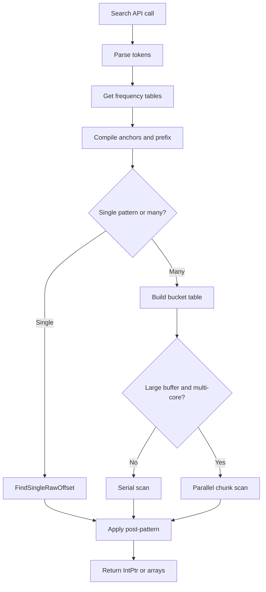

`PatternSearcher` is the core engine in `Llama.Memory`. Understanding its execution model helps you write faster signatures, choose the right overload, and avoid incorrect assumptions about offsets and parallel execution.

## What It Is

The scanner lifecycle is the path from `Search(...)` or `SearchMany(...)` to the final `IntPtr` results. Internally, that lifecycle has four phases:

1. Parse the pattern string into raw bytes, masks, and command tokens.
2. Compile the pattern into an anchor-aware representation.
3. Scan the buffer using optimized candidate selection and full masked comparison.
4. Transform raw offsets into final return values.

## Why It Exists

Most signature scanners fail in one of two ways: they are simple but slow, or fast but rigid. `Llama.Memory` aims for a middle ground. It keeps the public API small, but internally it uses frequency-aware anchors, prefix rejection, shared multi-pattern compilation, and optional parallel chunking so the same class works for both one-off searches and heavier signature sets.

## How It Relates to Other Concepts

- `Pattern Syntax` defines what the scanner compiles.
- `PE Metadata` explains where the input slices and image-base values usually come from.
- `ISearcher` describes the behavioral contract the scanner implements.

If pattern syntax is the language, the scanner lifecycle is the execution engine.

## How It Works Internally

The public search methods in `Llama.Memory/PatternSearcher.cs` are intentionally thin (`PatternSearcher.cs`, lines 69-125). Single-pattern methods parse and compile immediately. Array-based methods call `GetOrBuildCompiled`, which caches the compiled results for the exact same `string[]` instance under a lock (`PatternSearcher.cs`, lines 159-178). That is a reference-based cache, not a content-based cache, so reusing the same array instance is what avoids recompilation.

The frequency pass in `GetFrequencyTables` computes two histograms over the current data buffer: a 256-slot byte table and a 65,536-slot adjacent-byte-pair table (`PatternSearcher.cs`, lines 127-157). `BuildCompiled` then chooses the least common fully concrete adjacent pair when it can, otherwise the least common fully concrete single byte (`PatternSearcher.cs`, lines 381-472). It also stores up to the first eight bytes of the pattern as a prefix word plus prefix mask for cheap rejection (`PatternSearcher.cs`, lines 458-470 and 1303-1336).

For multi-pattern search, `BuildBucketTable` groups pattern indexes by anchor pair or single anchor byte (`PatternSearcher.cs`, lines 513-652). The serial scanners then do three passes:

- no-anchor patterns,
- pair-anchored patterns,
- single-anchor patterns.

Pair-anchored and single-anchor passes use `IndexOf`, `IndexOfAny`, and bucket lookups to avoid trying every pattern at every offset (`PatternSearcher.cs`, lines 721-937 and 1090-1289). Only surviving candidates run the full masked compare.

When the input size is at least `256 * 1024` bytes and more than one processor is available, the scanner uses `Parallel.For` to split the work into overlapping chunks (`PatternSearcher.cs`, lines 11-12, 679-718, and 995-1034). The overlap is large enough to preserve matches at chunk boundaries. For "first hit per pattern" scans, `TryPublishEarliestRawOffset` uses `Interlocked.CompareExchange` so threads race safely toward the smallest discovered raw offset (`PatternSearcher.cs`, lines 939-959).



## Basic Usage

```csharp
using Llama.Memory;

var searcher = new PatternSearcher(File.ReadAllBytes("module.bin"), IntPtr.Zero);
var firstHit = searcher.Search("48 8B ?? ?? 89");

if (firstHit != IntPtr.Zero)
{
    Console.WriteLine($"Found at offset 0x{firstHit.ToInt64():X}");
}
```

This path compiles one pattern and stops at the first match.

## Advanced Usage

```csharp
using Llama.Memory;

var patterns = new[]
{
    "48 8D 0D ? ? ? ? Add 3 TraceRelative",
    "E8 ? ? ? ? TraceCall",
    "41 B8 ? ? ? ?"
};

var searcher = new PatternSearcher(File.ReadAllBytes("module.bin"), new IntPtr(0x1000));
var firstHits = searcher.Search(patterns);
var allHits = searcher.SearchMany(patterns);

for (var i = 0; i < patterns.Length; i++)
{
    Console.WriteLine($"{patterns[i]} => first={firstHits[i].ToInt64():X} total={allHits[i].Length}");
}
```

This path compiles all patterns once, builds a bucket table, and reuses the same compiled set across two different multi-pattern operations if the same array instance is reused.

## Common Pitfalls

<Callout type="warn">
The multi-pattern compilation cache is keyed by array reference, not by string contents. If you rebuild a new `string[]` with identical text on every call, `PatternSearcher` will recompile the patterns each time. Reuse a stable array instance when you want the cache in `GetOrBuildCompiled` to pay off.
</Callout>

Another pitfall is assuming `SearchMany(string pattern)` returns overlapping matches. It does not. After each hit, the implementation advances by the full pattern length (`PatternSearcher.cs`, lines 321-339). If your use case depends on overlapping matches, you need a different search strategy than the built-in repeated-first-hit loop.

## Trade-Offs

<Accordions>
<Accordion title="Why use anchor frequencies from the current buffer?">
Using the current buffer to score anchors gives the scanner a practical advantage over fixed heuristics. A byte pair that is rare in one executable may be extremely common in another, so a data-aware choice reduces wasted comparisons in real binaries. The downside is startup cost: the first search over a new `PatternSearcher` instance must build the frequency tables, which is extra work if you only ever run one trivial scan. The library makes that trade because repeated or non-trivial scans are the main use case.

```csharp
var searcher = new PatternSearcher(bytes, IntPtr.Zero);
var a = searcher.Search(patternA);
var b = searcher.Search(patternB);
```
</Accordion>
<Accordion title="Why parallelize only above a size threshold?">
Parallel scanning adds coordination cost, overlap handling, and result merging. On small buffers, those costs can exceed the benefit of using more cores, so `PatternSearcher` only switches when the input is large enough and the process has multiple processors available. This means the same code path may behave differently depending on buffer size, but the threshold avoids paying parallel overhead where it would hurt throughput. The implementation still preserves deterministic result ordering by writing the earliest offsets into indexed slots and merging chunk outputs carefully.

```csharp
var hits = searcher.Search(patterns);
```
</Accordion>
</Accordions>

## Related Pages

- `/docs/pattern-syntax` for the signature language itself.
- `/docs/api-reference/pattern-searcher` for constructor and method signatures.
- `/docs/guides/scan-pe-section` for a full file-backed workflow.
